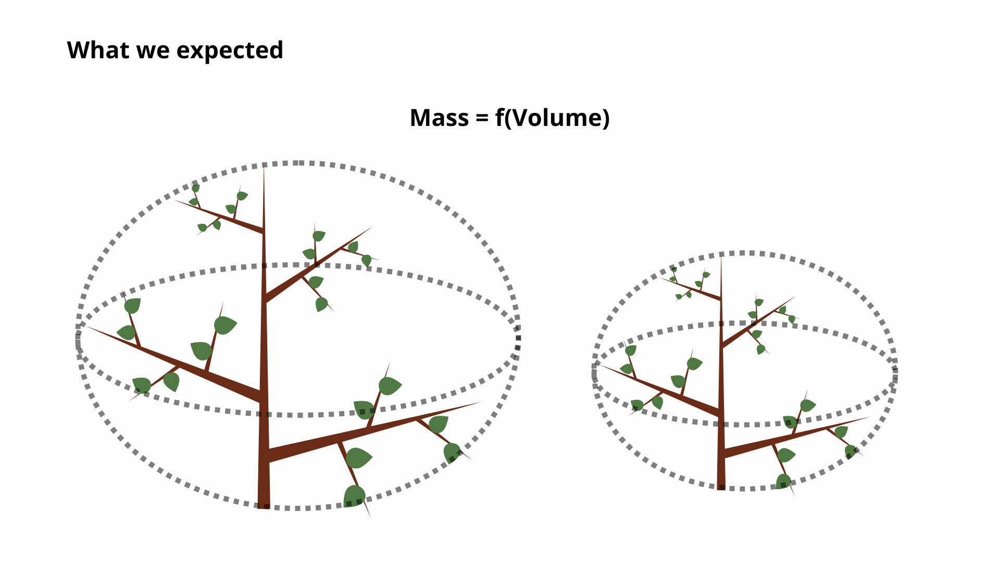
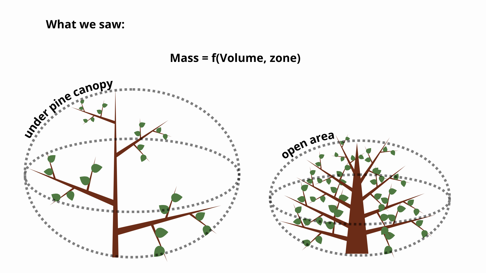

# Shrub size

## Mass vs volume



## Mass vs volume



## Biomass measurements

- We selected 5 shrubs per species and zone. 
- Shrubs selected to represent all variation of shrubs in the original experiment. 

## Biomass measurements
:::: {.columns}

::: {.column width="40%"}
**In the field**

- Height and two diameters
- Fresh weight of the entire shrub
- Fresh weight of a sample

**In the lab**

- Dry weight of the sample
:::

::: {.column width="60%"}

:::

::::

## Predictive models

```{r}
# Libraries
library(tidyverse)
library(MuMIn)
library(performance)
library(glmmTMB)

options(na.action = "na.fail")
# Load data
df.biomass <- read.csv2(file = "00-data/shrub_biomass.csv")

# source("01-scripts/01.2-surv_par_vol.R")

df.biomass <- 
df.biomass |> 
  rename(volume = Volumen.arbusto..m3., 
         mass = Peso.seco.arbusto..g., 
         log.volume = Log.Volumen, 
         log.mass = Log.masa, 
         zone = ambiente, 
         microsite = Especie) |> 
  mutate(
    microsite = recode(microsite, 
                  "Gs" = "Genista scorpius",
                  "Cl" = "Cistus ladanifer", 
                  "Rc" = "Rosa canina"
                  ),
    zone = recode(zone, 
                  "Abierto" = "open area", 
                  "pinar"   = "pine canopy")
  ) |> 
  mutate(
    zone = factor(zone), 
    microsite = factor(microsite)
  ) 


m_full <- glmmTMB(log.mass ~ log.volume * microsite * zone,
             data = df.biomass)


dd <- dredge(m_full)

modelo <- get.models(dd, subset = 1)[[1]]

performance::performance(modelo)
parameters::model_parameters(modelo)

results_biomass <- df.biomass |>
  group_by(microsite, zone) |>
  nest() |>                                              # crea list-column 'data'
  mutate(
    model  = map(data, ~ glm(mass ~ volume, data = .x, family = Gamma(link = "log"))),
    tidied = map(model, broom::tidy),                   # coeficientes
    glanced = map(model, broom::glance)                 # R², AIC, etc.
  )

source(file = "01-scripts/01.2-surv_par_vol.R")
# Predict biomass values
df.surv.par.vol <- df.surv.par.vol |> 
  mutate(log.volume = log(volume))

df.model <- 
df.surv.par.vol |> 
  select(Individual, volume, microsite, zone) |> 
  filter(microsite != "gap") |> 
  droplevels() |> 
  drop_na() |> 
  unique()

predictions <- df.model |>
  group_by(microsite, zone) |>
  nest() |>
  left_join(
    results_biomass |> select(microsite, zone, model),
    by = c("microsite", "zone")
  ) |>
  mutate(
    pred.mass = map2(model, data, ~ predict(.x, newdata = .y, type = "response"))
  ) |>
  unnest(c(data, pred.mass))       # devuelve un dataframe plano

# Prediction validation
predictions.validation <- df.biomass |>
  group_by(microsite, zone) |>
  nest() |>
  left_join(
    results_biomass |> select(microsite, zone, model),
    by = c("microsite", "zone")
  ) |>
  mutate(
    pred.mass = map2(model, data, ~ predict(.x, newdata = .y, type = "response"))
  ) |>
  unnest(c(data, pred.mass))       # devuelve un dataframe plano


predictions.validation <- predictions.validation |> 
  mutate(
    res = pred.mass - mass
  )

plot(
  predictions.validation$mass, 
  predictions.validation$pred.mass,
  main = "Predictive capacity of shrub mass.",
  xlab = "Measured mass (g)",
  ylab = "Estimated mass (g)"
)
abline(0, 1, col = "red", lty = 2)

# 3. Segundo gráfico (Homocedasticidad)
plot(
  x = predictions.validation$pred.mass, 
  y = predictions.validation$res, 
  main = "Homoscedasticity of residuals", 
  xlab = "Estimated mass (g)", 
  ylab = "Residuals"
)
abline(h = 0, col = "red", lty = 2)
```


## Inclusion of biomass

```{r, echo=FALSE, message=FALSE}
# Load data
source("01-scripts/01.1-gps.R")             # gps and elevation info
source("01-scripts/01.2-surv_par_vol.R")    # survival, par and volume
source("01-scripts/01.5-predict_biomass.R") # load biomass

rm(list = setdiff(ls(), c("df.surv.par.vol", "df.shrubs.gps")))

df.shrubs.gps <- df.shrubs.gps |> 
  mutate(
    Elevation_c = scale(Elevation), 
    Individual = as.factor(Individual)
  )

# Merge
df <- merge(
  x = df.shrubs.gps   |> select(Individual, X, Y, Elevation, Elevation_c), 
  y = df.surv.par.vol |> select(Individual, zone, microsite, quercus_sp, height, diam_1, diam_2, volume, pred.mass, survival, surv_date), 
  by = "Individual"
)

# Only data from september

df <- df |> 
  filter(surv_date == "16/09/2025") |> 
  filter(!is.na(survival)) |> 
  unique()

# Dataset with only:
# - survival info
# - size info

df <- df |> 
  filter(microsite != "gap") |> 
  mutate(survival = if_else(survival == 2, 1, survival)) |> 
  drop_na(survival) |> 
  unique()

df <- df |> 
  mutate(
    log.pred.mass   = log(pred.mass), 
    log.pred.mass_c = scale(log.pred.mass)
  )
```

```{r}
modelo <- glmmTMB(survival ~ 
                    zone +
                    microsite +
                    quercus_sp + 
                    Elevation_c + 
                    log.pred.mass_c + 
                    zone:microsite + 
                    zone:Elevation_c + 
                    microsite:Elevation_c +
                    zone:log.pred.mass_c +
                    microsite:log.pred.mass_c +
                    (1 | Individual),
                  data = df,
                  family = binomial()
)

car::Anova(modelo)
parameters::model_parameters(modelo, exponentiate = TRUE)
```

## Inclusion of biomass

### survival ~ mass * microsite

Pr(>Chisq) = 0.015808 *

```{r}
library(ggeffects)
# Efecto de masa del arbusto por microsite
plot(ggpredict(modelo, terms = c("log.pred.mass_c[all]", "microsite")))
```

### survival ~ mass * zone

Pr(>Chisq) = 0.051705 .

```{r}
# Efecto de masa por zona
plot(ggpredict(modelo, terms = c("log.pred.mass_c[all]", "zone")))
```

### survival ~ microsite * elevation

Pr(>Chisq) = 0.032678 *

```{r}
# Efecto de microsite por elevacion
plot(ggpredict(modelo, terms = c("Elevation_c[all]", "microsite")))
```

### survival ~ zone * elevation

Pr(>Chisq) = 0.064771 .

```{r}
# Efecto de elevacion por zona
plot(ggpredict(modelo, terms = c("Elevation_c[all]", "zone")))
```

# RII

## What relations are meaningfull?

$$
RII = \frac{A-B}{A+B}
$$

Per *Quercus* species (*Q. faginea* and *Q. ilex*): 

**Direct shrub effect**

- A: Survival under shrub in open area.
- B: Survival without shrub (gaps) in open area.

**Conditioned shrub effect**

- A: Survival under shrub and under pine canopy.
- B: Survival without shurb (gaps) under pine canopy.

**Pine canopy effect**

- A: Survival without shurb (gaps) under pine canopy.
- B: Survival without shrub (gaps) in open area.

## Calculation of RII

- A: Focal group. 
- B: Reference group. 

$$
A=\{a_1,a_2,\ldots,a_n\}
$$

$$
B=\{b_1,b_2,\ldots,b_m\}
$$

$$
RII_{ij} = \frac{S_{a_i}-S_{b_i}}{S_{a_i}+S_{b_i}}
$$

except when:

$$
S_a+S_B=0\text{ ; }RII=0
$$

because of $S$ is binary (0, 1):

| (S_{a_i}) | (S_{b_j}) | (RII_{ij})                  |
| --------- | --------- | --------------------------- |
| 1         | 0         | 1                           |
| 0         | 1         | -1                          |
| 1         | 1         | 0                           |
| 0         | 0         | 0 (defined by convention)   |


then I calculated the mean and SD per individual:

$$
\overline{RII}_i
=
\frac{1}{m}
\sum_{j=1}^{m}
RII_{ij}
$$

$$
SD_i
=
\sqrt{
\frac{
\sum_{j=1}^{m}
\left(RII_{ij}-\overline{RII}_i\right)^2
}
{m-1}
}
$$

## Results

```{r}
df.surv <- df.surv.par.vol |> 
  select(Individual, zone, microsite, quercus_sp, survival, surv_date) |> 
  mutate(survival = if_else(survival == 2, 1, survival)) |> 
  filter(surv_date == "16/09/2025") |> 
  unique()

df.surv.qf <- df.surv |> 
  filter(quercus_sp == "QF")

df.surv.qi <- df.surv |> 
  filter(quercus_sp == "QI")

#  4. Describe comparisons -----------------------------------
# Each row: focal group (A) vs reference group (B). 

comparisons <- tibble(
  zone_A  = c("pine canopy", "pine canopy",    "pine canopy",
              "open area",   "open area",       "open area",
              "pine canopy"),
  ms_A    = c("Cistus ladanifer",  "Rosa canina",    "Genista scorpius",
              "Cistus ladanifer",  "Rosa canina",    "Genista scorpius",
              "gap"),
  zone_B  = c("pine canopy", "pine canopy",    "pine canopy",
              "open area",   "open area",       "open area",
              "open area"),
  ms_B    = c("gap",         "gap",            "gap",
              "gap",         "gap",            "gap",
              "gap")
)

# 5. Function: cross join + RII per comparison  -----------------

calc_rii <- function(df, zone_A, ms_A, zone_B, ms_B) {
  
  focal <- df |>
    filter(zone == zone_A, microsite == ms_A) |>
    select(ind_A = Individual, zone_A = zone, ms_A = microsite, surv_A = survival)
  
  ref <- df |>
    filter(zone == zone_B, microsite == ms_B) |>
    select(ind_B = Individual, zone_B = zone, ms_B = microsite, surv_B = survival)
  
  cross_join(focal, ref) |>
    mutate(
      RII = if_else(surv_A + surv_B == 0, 0,          # denominador 0 → RII = 0
                    (surv_A - surv_B) / (surv_A + surv_B))
    )
}

#  5. Apply function to every comparison and combine --------------------

df.rii.qi <- pmap(comparisons, calc_rii, df = df.surv.qi) |>
  bind_rows()

df.rii.qf <- pmap(comparisons, calc_rii, df = df.surv.qf) |>
  bind_rows()

#  6. Calculate mean and SE per individual

aggID.df.rii.qi <- df.rii.qi |> 
  group_by(ind_A, zone_A, ms_A) |> 
  summarise(
    mean = mean(RII, na.rm = TRUE), 
    sd   = sd(RII, na.rm = TRUE)
  )

aggID.df.rii.qf <- df.rii.qf |> 
  group_by(ind_A, zone_A, ms_A) |> 
  summarise(
    mean = mean(RII, na.rm = TRUE), 
    sd   = sd(RII, na.rm = TRUE)
  )

theme_set(theme_bw())
```

```{r}
p1 <- 
aggID.df.rii.qi |> 
  group_by(ms_A, zone_A) |> 
  summarise(
    n = sum(!is.na(mean)),
    media = mean(mean, na.rm = TRUE),
    se = sd(mean, na.rm = TRUE) / sqrt(n),
    .groups = "drop"
  ) |> 
  ggplot(aes(x = media, y = ms_A)) + 
  geom_point() +
  geom_errorbarh(aes(xmin = media - se, xmax = media + se), width = .5) +
  geom_vline(aes(xintercept = 0), linetype = "dashed", colour = "red") +
  facet_wrap(~zone_A) +
  ylab("") +
  xlab("RII") +
  labs(title = "Q. ilex") +
  coord_cartesian(xlim = c(-.6, .6))

p2 <-
aggID.df.rii.qf |> 
  group_by(ms_A, zone_A) |> 
  summarise(
    n = sum(!is.na(mean)),
    media = mean(mean, na.rm = TRUE),
    se = sd(mean, na.rm = TRUE) / sqrt(n),
    .groups = "drop"
  ) |> 
  ggplot(aes(x = media, y = ms_A)) + 
  geom_point() +
  geom_errorbarh(aes(xmin = media - se, xmax = media + se), width = .5) +
  geom_vline(aes(xintercept = 0), linetype = "dashed", colour = "red") +
  facet_wrap(~zone_A) +
  ylab("") +
  xlab("RII") +
  labs(title = "Q. faginea") +
  coord_cartesian(xlim = c(-.6, .6))

library(patchwork)

p1/p2
```

