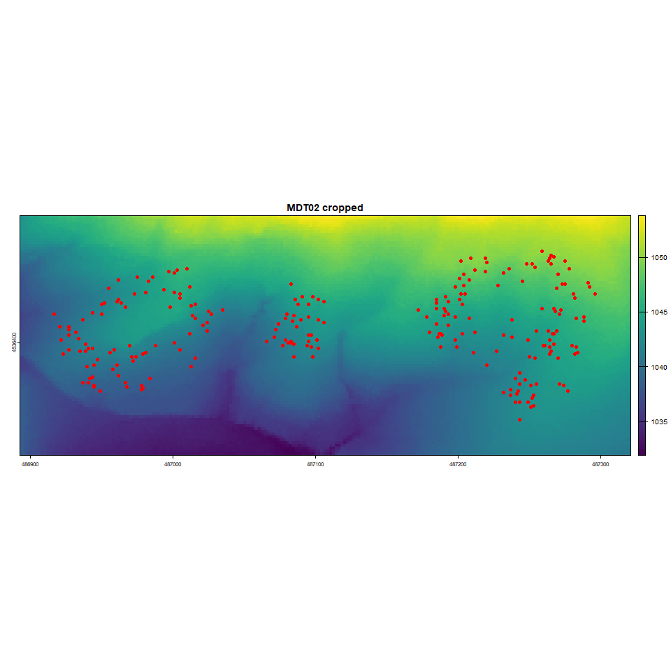
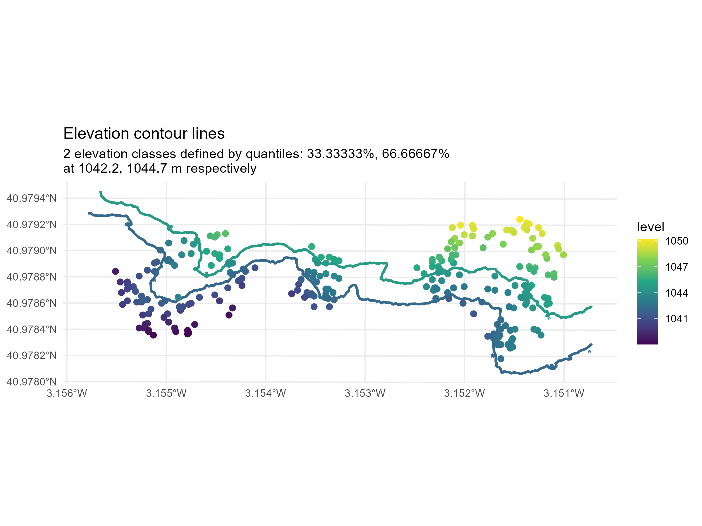
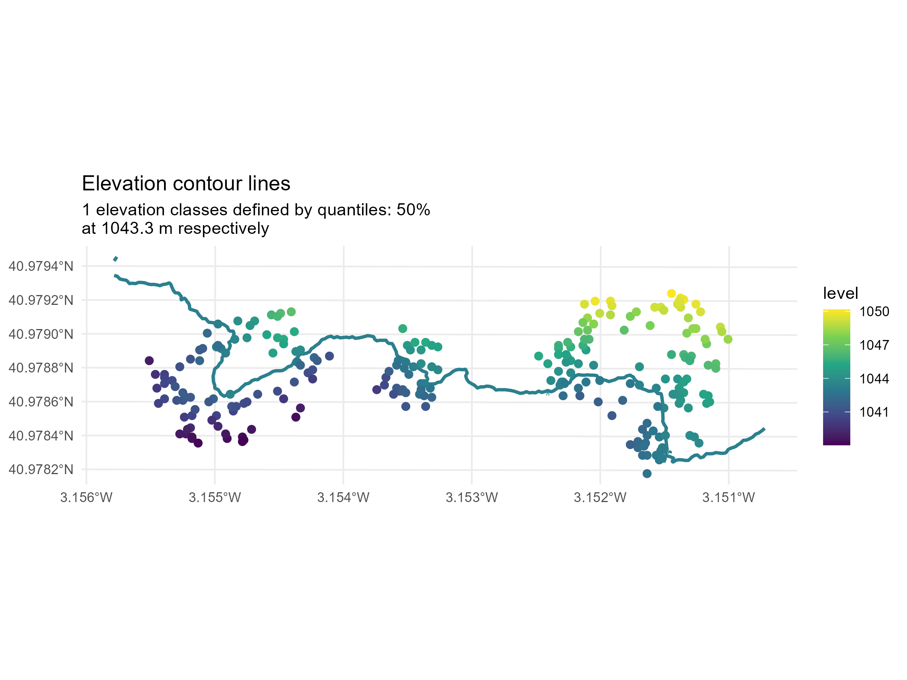

# Introduction

Spatial variation in elevation may influence survival patterns through associated differences in moisture conditions. To control for this potential confounding effect, the landscape could be partitioned into three elevational zones. An important methodological consideration is how to define these zones so that they both reflect the underlying terrain structure and preserve a reasonably balanced sample size across categories.

The objectives of this report are:

- O1. To define a method for partitioning the landscape into three elevational zones that reflect the underlying terrain structure while maintaining balanced sample sizes across categories.
- O2. To assess whether habitat types (forest canopy vs. gap) and microsites (shrub species vs. open areas) are homogeneously distributed across the elevational gradient.
- O3. To evaluate whether elevation affects seedling survival.

# Summary

- What have we done?:
  - Elevation discretised into quantile-based bands (2–3 levels).
  - Comparison of continuous vs categorical formulations of elevation.
  - Assessment of non-linear effects using GAMs.
  - Evaluation of interactions in GLMMs (elevation × microsite × zone).
  - Model selection based on AIC, BIC, and predictive performance metrics.
- What problems did we found?:
  - Narrow elevation gradient, limiting elevational grouping.
  - Species sorting along elevation:
    - *Rosa canina*: mainly low elevations under pine canopy
    - *Genista scorpius*: mainly high elevations in open areas
  - Highly unbalanced elevation bands.
  - Moderate model selection uncertainty between top GLMMs.
- What results did we obtained?
  - General trend: survival decreases with elevation in most microsites.
  - Exception: under *Rosa canina*, a weak opposite trend is observed.
  - Inclusion of elevation refines microsite ranking:
  - simpler models: highest survival under *Cistus ladanifer*
  - full models: slightly higher survival under *Genista scorpius*
  - Interaction signal: weaker elevation-related decline in survival under pine canopy vs open areas.
  - Continuous elevation consistently outperformed categorical formulations (AIC/BIC).
  - No evidence for strong non-linear effects (GAM results; edf ≈ linear).
  - BIC favoured a simplified model with a general (non-interacting) elevation effect.
  - Elevation is best retained as a linear covariate controlling for environmental gradients.

# Methods

A 5 m resolution digital terrain model (DTM) was imported and used to extract elevation values for each shrub sampling point (PNOA-MDT05-ETRS89-HU30-0486-LID.TIF; MDT05-cob1 2008-2015 CC-BY 4.0). Shrub locations were read from a CSV file and converted into spatial point features using the UTM coordinate reference system (EPSG:25830). The DTM was then cropped to the extent of the shrub points plus a 25 m buffer to reduce the analysis area to the relevant portion of the landscape.



Elevation values were extracted from the cropped DTM at each shrub location and added to the shrub dataset. Based on these elevation values, the study area was partitioned into two and three elevational classes using quantile-based thresholds, so that the resulting categories contained a relatively balanced number of observations. For the two-class scheme, observations were assigned to low and high elevation zones. For the three-class scheme, observations were classified as low, medium, or high elevation.

Survival data from a separate file were then merged with the shrub dataset using the treatment identifier as the matching key, linking each microsite to its corresponding survival information. Finally, the dataset was restricted to observations corresponding to the survival survey conducted on 16 September 2025, and duplicate records were removed.

```{r}
library(DT)
library(here)
library(tidyverse)
library(glmmTMB)
library(performance)
library(equatiomatic)
library(gtsummary)
library(mgcv)
library(sjPlot)
library(MuMIn)
library(knitr)
library(kableExtra)
library(DHARMa)
```

```{r}
# Load digital terrain model 5m
r <- terra::rast("00-data/PNOA_MDT05_ETRS89_HU30_0486_LID.tif")

# Load shrub positions
df.shrubs.gps <- read.csv2(file = "00-data/shrubs_gps.csv")

## Change variable names and
## codification of zone
df.shrubs.gps <- df.shrubs.gps |> 
  select(-X.1, -RP) |> 
  rename(
    Individual     = Tratamiento, 
    Zone           = Ambiente, 
    microsite_code = SP
    ) |> 
  mutate(
    Zone = recode(
      Zone, 
      "abierto" = "open", 
      "pinar "   = "pine canopy"
    )
  )

pts <- sf::st_as_sf(
  df.shrubs.gps,
  coords = c("X", "Y"),
  crs = 25830
)

# Convert points to SpatVector
vpts <- terra::vect(pts)
  
  dem_crop <- terra::crop(
    r,
    terra::ext(vpts) + 25  
  )
  
  
dem_mask <- terra::mask(dem_crop, vpts)

# Compute slope
slope <- terra::terrain(
  dem_crop,
  v = "slope",
  unit = "degrees"
)

# extract elevation and slope data
elev <- terra::extract(dem_crop, vpts)
slop <- terra::extract(   slope, vpts)
df.shrubs.gps$Elevation <- elev[,2]
df.shrubs.gps$Slope     <- slop[,2]

df.surv.par.vol <- read.csv2("00-data/vol_par_surv.csv")

df.surv.par.vol <- df.surv.par.vol |> 
  dplyr::select(micrositio, ambiente, especie_facilitadora, especie_facilitada, # Categorical var
         altura, diametro_1, diametro_2, # numerical, biotic
         luminosidad_1, luminosidad_2, luminosidad_3, fecha_luminosidad, posicion_luminosidad, # abiotic, PAR, 
         supervivencia, fecha_supervivencia # survival, response
  ) |> 
  dplyr::rename(
    Individual = micrositio,
    zone       = ambiente,
    microsite  = especie_facilitadora, 
    quercus_sp = especie_facilitada, 
    height     = altura, 
    diam_1     = diametro_1, 
    diam_2     = diametro_2, 
    par_1      = luminosidad_1, 
    par_2      = luminosidad_2, 
    par_3      = luminosidad_3, 
    par_date   = fecha_luminosidad, 
    par_posi   = posicion_luminosidad, 
    survival   = supervivencia, 
    surv_date  = fecha_supervivencia
  ) |> 
  mutate(
    microsite = recode(microsite, "claro" = "gap"), 
    zone = recode(zone, "abierto" = "open area", "pinar" = "pine canopy")
  )

n.values <- c(2, 3)

# Variables indicating elevation range
q.elevation1 <- quantile(
  df.shrubs.gps$Elevation,
  probs = seq(0, 1, by = 1/n.values[1])
)[-c(1, n.values[1]+1)]

q.elevation2 <- quantile(
  df.shrubs.gps$Elevation,
  probs = seq(0, 1, by = 1/n.values[2])
)[-c(1, n.values[2]+1)]

threshold1 <- as.numeric(q.elevation1)
threshold2 <- as.numeric(q.elevation2)

df.shrubs.gps <- df.shrubs.gps |>
  mutate(
    ElevationClass1 = case_when(
      Elevation < threshold1 ~ "low",
      Elevation >= threshold1 ~ "high"
    ), 
    ElevationClass2 = case_when(
      Elevation < threshold2[1] ~ "low", 
      Elevation >= threshold2[1] & Elevation < threshold2[2] ~ "medium", 
      Elevation >= threshold2[2] ~ "high"
    ), 
    Elevation_c = scale(Elevation), 
    Individual = as.factor(Individual)
  )

# merge gps and survival
df <- merge(
  x = df.shrubs.gps   |> select(Individual, X, Y, Elevation, ElevationClass1, ElevationClass2, Elevation_c), 
  y = df.surv.par.vol |> select(Individual, zone, microsite, quercus_sp, height, diam_1, diam_2, survival, surv_date), 
  by = "Individual"
)

df <- df |>
  mutate(
    survival = if_else(survival == 2, 1, survival)
  )

df <- df |> 
  filter(surv_date == "16/09/2025") |> 
  filter(!is.na(survival)) |> 
  unique()
```

# Results

## *Continuous or categorical variable*?

While exploring the elevation values, we observed that elevation varied only by `{r} round(diff(range(df.shrubs.gps$Elevation)), 2)` meters (ranging from `{r} round(range(df.shrubs.gps$Elevation)[1], 2)` to `{r} round(range(df.shrubs.gps$Elevation)[2], 2)` meters). Therefore, differences in precipitation associated with elevation are likely negligible. However, differences in soil moisture could still occur due to surface runoff and water accumulation in lower areas.

When the experiment was divided into three zones, this small elevational difference resulted in a very narrow intermediate band, only about two meters wide. Differences in band width arise because quantiles were used to divide the data into groups with the same number of observations. Although this approach ensures equal sample sizes among groups, it does not necessarily produce groups that divide the elevation range evenly. This can be observed below under both the three-group and two-group classifications.





Therefore, dividing the data into two groups may provide a more appropriate approximation to the problem. However, since the original numerical variable is available, it may also be appropriate to work directly with the continuous variable in order to assess its effect.

In addition, although this approach allows the experiment to be divided into elevation bands with equal altitude ranges and equal numbers of observations, some species remain strongly biased toward particular elevation ranges. The most notable cases are *Rosa canina*, which occurs almost exclusively at low elevations within the pine canopy, and *Genista scorpius*, which is mainly found at high elevations in open areas (@fig-waffle). These biases remained unchanged when elevation was divided into three bands (low, medium, and high).

```{r}
#| label: fig-waffle
#| fig-cap: "Waffle chart of number of observations per microsite, zone and elevation class (low and high)"

# Number of observation per treatment per elevation class
library(waffle)

ggplot(data = df |> 
  group_by(zone, microsite, ElevationClass1) |> 
  summarise(
    n = n()
  ), aes(fill = microsite, values = n)) +
  geom_waffle(color = "white", size = 0.8, n_rows = 6) +
  facet_grid(ElevationClass1~zone) +
  theme_void() +
  scale_fill_manual(values = c("#69b3a2", "#404080", "#FFA07A", "#FFD700", "#FF6347", "#4682B4"))

## Accute unbalance between groups
```

## Elevation bias across treatments

Elevation records revealed a very narrow, though not completely homogeneous, gradient among environments and microsites (@tbl-summ.elevation; @fig-boxplot.elevation). Overall, open plots were located at slightly higher elevations than pine forest plots, with approximate ranges of 1042–1050 m in open areas and 1038–1046 m in pine forest. Although the absolute difference was small, this pattern indicates a systematic shift in elevation between environments.

Within each environment, some variation among species/microsites was also observed, although differences were small and distributions largely overlapped. In open areas, median elevations ranged between 1044 and 1045 m, whereas in pine forest they ranged between 1039 and 1043 m. Altogether, these results suggest that elevation was not perfectly balanced among treatments, making it reasonable to include it as a control covariate in survival analyses. *Rosa canina* is particularly biased toward lower elevations in the pine canopy. However, given the narrow overall range and the substantial overlap among distributions, elevation alone is unlikely to account for the observed differences among environments or microsites.

```{r}
#| label: tbl-summ.elevation
#| tbl-cap: "Descriptive statistics of treatments"

datatable(
df.shrubs.gps |> 
  group_by(Zone, microsite_code) |> 
  summarise(
    minimo = round(min(Elevation), 2), 
    q25 = round(quantile(Elevation, 0.25), 2), 
    q50 = round(quantile(Elevation, 0.50), 2), 
    media = round(mean(Elevation), 2), 
    q75 = round(quantile(Elevation, 0.75), 2), 
    maximo = round(max(Elevation), 2)
  )
)
```

```{r}
library(plotly)
range.y <- max(df.shrubs.gps$Y) - min(df.shrubs.gps$Y)
range.el <- max(df.shrubs.gps$Elevation) - min(df.shrubs.gps$Elevation)
f <- range.el / range.y

p3d <- plot_ly(
  data = df.shrubs.gps,
  x = ~X,
  y = ~Y,
  z = ~Elevation,
  type = "scatter3d",
  mode = "markers",
  color = ~Zone
) |> 
  plotly::layout(
    scene = list(
      aspectratio = list(
        x = 1,
        y = 1,
        z = f * 2
      )
    )
  )

p3d
```

```{r}
#| label: fig-boxplot.elevation
#| fig-cap: "Boxplot, violinplot and individual observations (points) of elevation among treatments. R: Rosa canina; J: Cistus ladanifer; A: Genista scorpius; C: gaps. Abierto: open area; pinar: pinus canopy."

p <- ggplot(df.shrubs.gps, aes(x = Elevation, y = microsite_code)) +
  geom_boxplot() +
  geom_violin(alpha = 0.2) +
  geom_jitter() +
  facet_wrap(~Zone, ncol = 1)

p
```

## Model selection

### Continuous or categorical?

When comparing elevation as a continuous covariate against two categorical codifications, the model including continuous elevation showed the best performance according to AIC, AICc, and BIC, with the highest weight of evidence. However, differences among models were small and measures of overall fit were very similar, suggesting that the choice of a continuous formulation is primarily a matter of parsimony rather than a substantial improvement in predictive performance.

```{r}
# Best model to account for elevation effect?

m1 <- glmmTMB(survival ~ Elevation_c +
                zone * microsite * quercus_sp +
                (1|Individual), 
              data = df, 
              family = binomial(link = "logit"))

m2 <- glmmTMB(survival ~ ElevationClass1 +
                zone * microsite * quercus_sp +
                (1|Individual), 
              data = df, 
              family = binomial(link = "logit"))

m3 <- glmmTMB(survival ~ ElevationClass2 +
                zone * microsite * quercus_sp +
                (1|Individual), 
              data = df, 
              family = binomial(link = "logit"))


compare_performance(m1, m2, m3)
```

```{r}
summary(m1)
```

### Lineal or not lineal?

There was no strong evidence for a non-linear relationship between elevation and survival probability. The generalized additive model (GAM), in which elevation was modelled using a smoothed function (`s(Elevation_c)`), showed a poorer fit than the equivalent linear model. Specifically, the GAM yielded an AIC of 591.6, whereas the model including a simple linear effect of elevation yielded an AIC of 585.3.

In addition, the smoothed term for elevation was not significant (p = 0.239). The estimated effective degrees of freedom (edf = 1.54) are particularly informative: the edf only slightly exceeded 1, suggesting a very weak curvature with no clear statistical support. The @fig-gam shows that this apparent lack of linearity is mainly expressed in the upper 20th percentile of elevation, where survival appears to decrease more strongly than would be expected under a strictly linear relationship.

```{r}
gam <- gam(
  survival ~ s(Elevation_c) +
    zone * microsite * quercus_sp +
    s(Individual, bs = "re"),
  data = df,
  family = binomial(link = "logit"),
  method = "REML"
)

glm <- gam(
  survival ~ Elevation_c +
    zone * microsite * quercus_sp +
    s(Individual, bs = "re"),
  data = df,
  family = binomial(link = "logit"),
  method = "REML"
)

AIC(gam, glm)

summary(gam)
```

```{r}
#| label: fig-gam
#| fig-cap: "Generalized additive model (GAM) predictions describing the relationship between elevation and seedling survival probability across microsites and environments. The smooth term for elevation did not reveal strong evidence of non-linear responses."

plot_model(
  gam,
  type = "pred",
  terms = c("Elevation_c", "microsite", "zone")
)
```

### Interactions or not?

The workflow followed a submodel selection strategy based on a global model, with the aim of evaluating to what extent increasing model complexity through the inclusion of elevation effects was justified.

The most complex fitted model was a logistic mixed-effects model (estimated using maximum likelihood and the “nlminb” optimizer) predicting survival as a function of scaled elevation, microsite, and zone (formula: survival \~ quercus_sp + Elevation_c \* microsite \* zone). The model included individual identity as a random effect ((1 \| Individual)).

```{r}
m_full <- glmmTMB(survival ~ quercus_sp + Elevation_c*microsite*zone +
                    (1|Individual), data = df, family = binomial(link = "logit"))
```

The decision not to include interactions with *Quercus* species was made to reduce model complexity. Previous analyses had already shown that *Quercus* species did not exhibit significant interaction coefficients with any other variable. Rather, *Quercus ilex* consistently showed higher survival than *Quercus faginea* across all conditions. Nevertheless, potential interactions could be explored further in future analyses.

Different subcombinations of fixed effects were generated using `MuMIn::dredge()` [@pkg-mumin] (@tbl-dd). Comparison among candidate models indicated that model 48 received the strongest support (Akaike weight = 0.429), although model 64 showed similarly strong support (Akaike weight = 0.277). Support declined substantially for the remaining models, with model 40 receiving the next highest support (Akaike weight = 0.085). The presence of two similarly supported models suggests moderate model selection uncertainty.

The main difference between the two best-supported models was the inclusion or exclusion of the `Elevation_c:zone` interaction term. Both models retained the `Elevation_c:microsite` interaction. This indicates evidence for an elevational effect on microsite responses, whereas evidence for an elevational effect on zone responses was less clear.

```{r}
#| label: tbl-dd
#| tbl-cap: "Candidate modelos with ΔAIC < 2"

options(na.action = "na.fail")
dd <- dredge(m_full)

tab <- subset(dd, delta < 10) |>
  as.data.frame() |>
  rownames_to_column("modelo") |>
  dplyr::select(modelo, AICc, delta, weight, `cond(Elevation_c)`, `cond(microsite)`, `cond(zone)`,
         `cond(Elevation_c:microsite)`, `cond(Elevation_c:zone)`, `cond(microsite:zone)`, `cond(Elevation_c:microsite:zone)`) |>
  mutate(across(c(AICc, delta, weight), ~ round(.x, 3)))

datatable(tab)
```

However, when comparing the three best-supported models using alternative information criteria:

```{r}
glmm1 <- get.models(dd, subset = 1)[[1]]
glmm2 <- get.models(dd, subset = 2)[[1]]
glmm3 <- get.models(dd, subset = 3)[[1]]

formula(glmm1)
formula(glmm2)
formula(glmm3)
```

BIC identified `glmm3` as the best model; that is, the model in which elevation only exerted a general effect on survival, without modulating the specific effects of microsite or zone. In addition, differences in predictive metrics such as conditional $R^2$, marginal $R^2$, RMSE and LogLoss were virtually negligible. This indicates that the explanatory capacity of the models changed very little, and that the main differences among them lie in the balance between goodness-of-fit and model complexity.

```{r}
compare_performance(glmm1, glmm2, glmm3)
```

No significant problems in normality, heteroscedasticity and overdispersion detected.

```{r}
res <- simulateResiduals(glmm1, n = 999)
plot(res)
testOverdispersion(res)
```

In models including the `Elevation_c:microsite` interaction, a characteristic survival pattern was detected beneath *Rosa canina*. Whereas survival generally decreased with elevation across all microsites within the study area, the opposite trend was observed under this species (@fig-glmm1a). Although this shift in response under *Rosa canina* is noteworthy, predicted survival probabilities estimated at both low and high elevations — while carefully avoiding extrapolation beyond the original elevation range of each treatment combination (i.e., each microsite × zone combination) — revealed that the actual difference in survival between elevations was relatively small.

```{r}
#| label: fig-glmm1a
#| fig-cap: "Effects of elevation on predicted seedling survival probability across microsites and environments estimated with a generalized linear mixed model (glmm1). Lines represent fitted values and shaded bands indicate 95% confidence intervals."

plot_model(
  glmm1,
  type = "pred",
  terms = c("Elevation_c[all]", "microsite", "zone"), 
  show.data = TRUE
)
```

```{r}
#| label: fig-glmm1b
#| fig-cap: "Effects of elevation on predicted seedling survival probability across microsites and environments estimated with a generalized linear mixed model (glmm1). Dots represent mean survival probability and lines represent 95% interval."

el.range <- c(
max(
df |> 
  group_by(zone, microsite) |> 
  summarise(
    minimo = min(Elevation_c),
    maximo = max(Elevation_c)
  ) |> 
  pull(minimo)),
min(
  df |> 
    group_by(zone, microsite) |> 
    summarise(
      minimo = min(Elevation_c),
      maximo = max(Elevation_c)
    ) |> 
    pull(maximo)))

range_txt <- paste0(
    "Elevation_c[",
    round(el.range[1], 2),
    ", ",
    round(el.range[2], 2),
    "]"
  )

plot_model(
    glmm1,
    type = "pred",
    terms = c("microsite", range_txt, "zone")
  ) + coord_flip() + facet_wrap(~facet, ncol = 1)
```

These estimated survival patterns appear to refine the results obtained from previous models. Earlier models that did not account for elevation identified survival beneath *Cistus ladanifer* as the highest among microsites (@fig-glmm0). However, once elevation was incorporated into the models, *Genista scorpius* showed slightly higher estimated survival (@fig-glmm1b).

```{r}
#| label: fig-glmm0
#| fig-cap: "Effects of microsite and environments on predicted seedling survival probability estimated with a generalized linear mixed model (glmm1). Dots represent mean survival probability and lines represent 95% interval."

glmm0 <- glmmTMB(survival ~ quercus_sp + microsite*zone +
                    (1|Individual), data = df, family = binomial(link = "logit"))

plot_model(
    glmm0,
    type = "pred",
    terms = c("microsite", "zone")
  ) + coord_flip()
```

Model `glmm2`, which included an elevation effect varying according to zone, indicated that within the pine canopy survival decreased more slowly with increasing elevation (@fig-glmm2).

```{r}
#| label: fig-glmm2
#| fig-cap: "Effects of elevation on predicted seedling survival probability across environment estimated with a generalized linear mixed model (glmm2). Lines represent fitted values and shaded bands indicate 95% confidence intervals."


plot_model(
  glmm2,
  type = "pred",
  terms = c("Elevation_c[all]", "zone"), 
  show.data = TRUE
)
```
