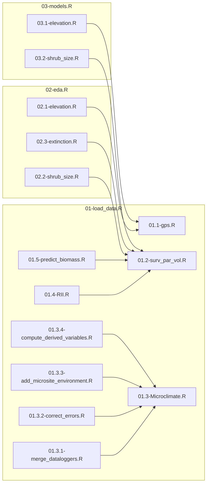

# Que_facil
Analyses conducted within the framework of the QueVadis Project on the facilitative capacity of Mediterranean shrub species, how this effect changes depending on target species with contrasting ecologies, and whether this effect can in turn be modulated by the presence of a tree canopy.

# Workflow

